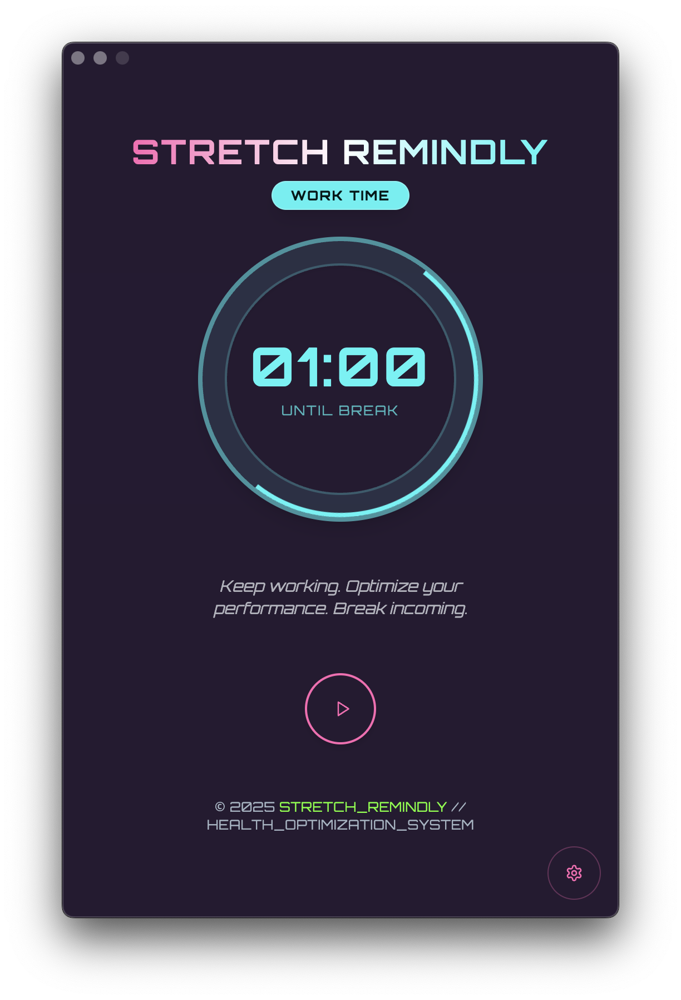
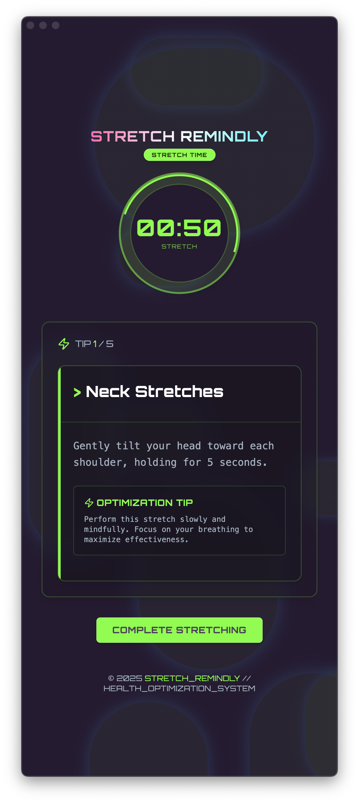
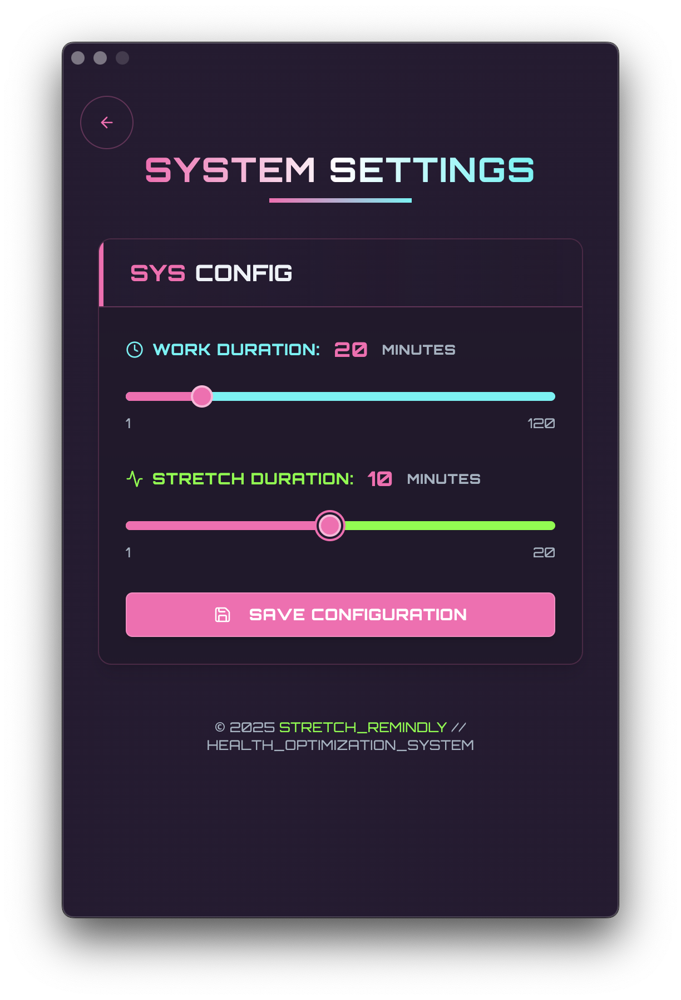

# 🧘 Stretch Remindly

| Intro                                   | Stretching                                         | Setting                                      |
| --------------------------------------- | -------------------------------------------------- | -------------------------------------------- |
|  |  |  |

**Stretch Remindly** is a simple yet effective desktop app for macOS that reminds you to stretch throughout the day.

It’s designed for people (like me) who spend long hours in front of a screen to stay mindful of their joint health 💪

Built with **Supabase**, **Electron**, and **Typescript** — with lots of good vibes coding ⚡️

🔗 Landing Page: [https://www.stretch-remindly.com/](https://www.stretch-remindly.com/)

---

## ✨ Features

- ⏰ Stretching reminders at user-defined intervals
- 🧘‍♀️ Stretching timer during break time
- 📖 Simple stretching guide
- 🍏 macOS support only (for now)

---

## 🚧 Upcoming Features

- 📊 History tracking and dashboard
- 🧘‍♂️ More detailed stretching guides
- 🛠️ Custom stretching routine builder
- 🔊 Voice guidance during stretches

---

## 🛠️ Build & Run Locally (macOS only)

You can build the app yourself from this codebase. Follow the steps below:

### 1. Clone the repository

```bash
git clone https://github.com/rheech22/stretch-remindly.git
cd stretch-remindly
```

### 2. Install dependencies

```bash
pnpm install
```

### 3. Build the app

```bash
pnpm electron:build
```

This will generate the `.dmg` installer in the `release` folder.

### 4. Run the installer

Navigate to the dist folder and open the generated `.dmg` file to install the app on your Mac.

---

## ⚠️ Notice

You can also download a prebuilt version from the landing page,
but since the app is not code-signed yet, you might see warnings or need to allow the app manually in your system settings.
To avoid this, we recommend building it yourself for now.

---
